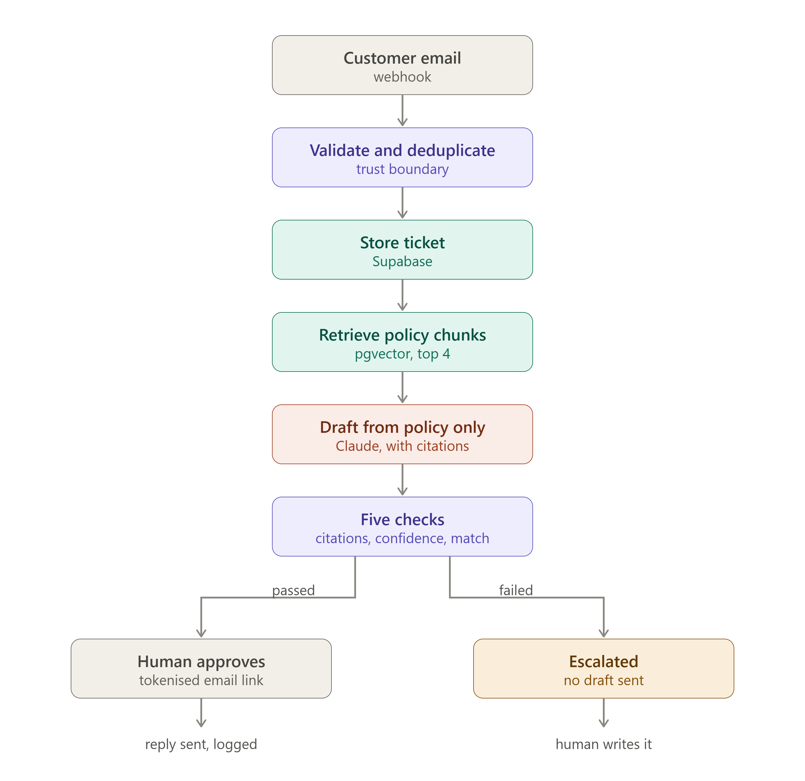
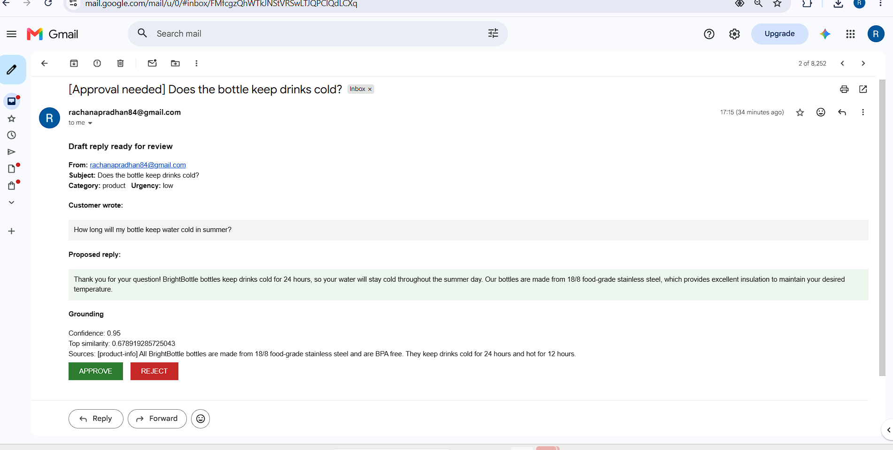
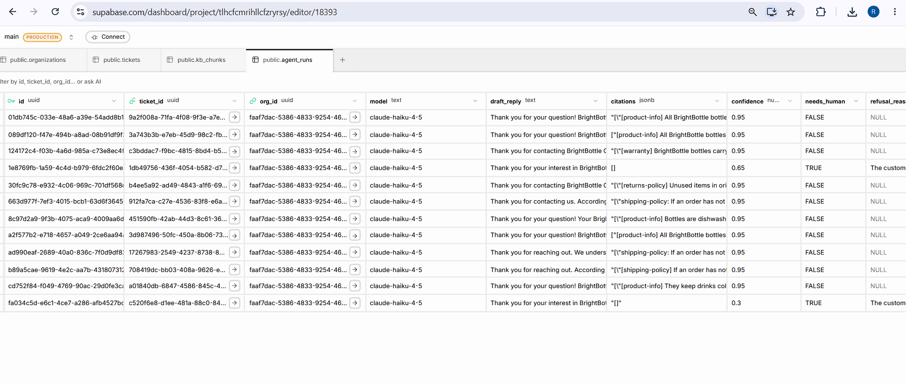

# Grounded Support Inbox Copilot

An AI support assistant that drafts customer replies **only** from a company's own approved documents, routes every draft to a human for one-tap approval, and escalates instead of guessing when it doesn't know the answer.

Built with n8n, Claude, Supabase (Postgres + pgvector), and Gemini embeddings.

---

## The problem

A small e-commerce business receives hundreds of support emails a month. Most are repetitive: shipping times, return windows, refund eligibility, product care. Two part-time reps spend hours writing the same answers, response times stretch to 8–14 hours, and policy answers drift — one rep says 14 days, another says 30.

Off-the-shelf AI chatbots make this worse, not better. An ungrounded model will confidently invent a return window that doesn't match company policy. The customer believes it. The business is then bound to a promise it never made.

## What this system does differently

It does not let the model *think up* an answer. It makes the model *find* one.

Every reply is generated strictly from retrieved policy text. If the retrieved policy doesn't contain the answer, the system sets `needs_human: true`, records why, and hands the ticket to a person — with no draft sent.

Three behaviours demonstrate this:

| Customer asks | System response |
|---|---|
| "Order is 3 days late, what's the refund policy if lost?" | Correct answer with the 10-business-day threshold, cited to `shipping-policy`. Does **not** promise a refund the policy doesn't allow. |
| "I dropped my bottle and it's dented — covered under warranty?" | Politely says no, quoting the exclusion. Does not soften it into a false maybe. |
| "Do you offer bulk discounts for 500 bottles?" | `confidence: 0.3`, no citations, escalated to a human. Invents no pricing. |

The third row is the one that matters commercially. A bot that always answers is a liability. A system that knows its own limits can be sold.

---

## Architecture



```
Customer email
   ↓
Webhook (Workflow A)
   ↓
Validate + normalize          ← trust boundary
   ↓
Deduplicate (message_id)      ← idempotency
   ↓
Create ticket + message       → Supabase
   ↓
Classify (Claude Haiku)       → category, urgency, validated against allow-list
   ↓
Embed question (Gemini)       → 768-dim vector
   ↓
Vector search (pgvector)      → top 4 policy chunks by cosine similarity
   ↓
Combine chunks                → single LLM call, not one per chunk
   ↓
Draft reply (Claude Haiku)    → grounded, cited, self-scored
   ↓
Validate draft                ← five independent checks
   ↓
Log agent run                 → Supabase (full audit record)
   ↓
Decision gate
   ├── safe    → status: awaiting_approval → approval email with tokenised links
   └── unsafe  → status: escalated → human handles the whole ticket

Rep clicks APPROVE (Workflow C)
   ↓
Verify token                  ← rejects forged links
   ↓
Check not already decided     ← prevents double-send
   ↓
Record decision               → who, when, what was sent
   ↓
Send reply to customer
   ↓
status: answered
```

### Three workflows, deliberately separated

| Workflow | Trigger | Purpose |
|---|---|---|
| `A-Main` | Webhook (inbound message) | Ingest, classify, retrieve, draft, decide |
| `B-Embeddings` | Manual | One-off: chunk → embed → store knowledge base |
| `C-Approval` | Webhook (rep clicks link) | Verify, record decision, send reply |

The approval loop is a **separate workflow**, not a paused execution. The main workflow finishes and the ticket state lives in the database. A rep can approve three hours or three days later and nothing is lost. This is also the shape the system would take as a standalone backend — the approval endpoint becomes an API route rather than a webhook.

---

## Grounding: why RAG is genuinely required here

Not bolted on. It is the entire product.

- **Corpus:** company policy documents, split into self-contained chunks (~8 chunks for the demo business)
- **Chunking:** one policy rule per chunk, so retrieval returns a complete answer rather than a fragment
- **Embeddings:** `gemini-embedding-001` at 768 dimensions, same model and dimensionality for both documents and queries
- **Storage:** Postgres `vector(768)` column via pgvector
- **Retrieval:** cosine distance (`<=>`), top 4 above a similarity floor, scoped by `org_id`
- **Injection:** retrieved chunks passed as `POLICIES:` with their source tags
- **Citation:** the model must return the chunk sources it used; a draft with zero citations is automatically escalated

Semantic retrieval matters, not keyword search. A customer writing *"my order never showed up"* contains none of the words *lost*, *delivery*, or *refund* — but retrieves the correct lost-package policy at 0.79 similarity.

### The five validation checks

A draft is only eligible for approval if **all** of these pass:

1. The model returned parseable JSON
2. `draft_reply` is non-empty
3. `citations` is non-empty
4. `confidence >= 0.7`
5. `top_similarity >= 0.5`

Check 5 is the important one — it does not come from the model. The model has no idea how well the retrieved policies matched the question. The system does, and enforces it independently. **Self-reported confidence is not sufficient.**

---

## Safety and correctness: enforced by the database, not the workflow

The recurring design principle in this project: a workflow can have a bug, and a human writing SQL can make a typo. The database should refuse both.

| Constraint | Prevents |
|---|---|
| `unique (org_id, message_id)` | The same email processed twice, even if two copies arrive simultaneously |
| `not null` on required columns | Tickets with no customer, messages with no owner |
| `references` (foreign keys) | Orphaned records pointing at organizations that don't exist |
| `check (status in (...))` | A typo like `anwsered` silently stranding a ticket forever |
| `check (decision in (...))` | Anything other than `approve`/`reject` landing in the decision field |
| `not null` on `approvals.token` | An approval row created without its security token |
| `before update` trigger on `tickets` | `updated_at` going stale — the database maintains it, no caller has to remember |

Each of these was added in response to a failure observed during the build, not copied from a checklist. The `status` check exists because a typo did get through. The uniqueness constraint exists because a duplicated email did create a phantom ticket.

### Multi-tenancy from day one

Every table carries `org_id`, including `messages`, where it is technically redundant (a message belongs to a ticket, which knows its organization). The redundancy is deliberate: each table can answer *"who owns me?"* without a join, which makes the eventual Row Level Security policies simple to write and fast to evaluate. Retrofitting tenant isolation onto a live system means migrating customer data while auditing every query written to date.

### Security measures in place

- **Tokenised approval links.** Each approval row carries a random token. The approval endpoint compares the token from the URL against the stored value and halts on mismatch. Verified by test: a link with a tampered token reaches the token check and stops there, with no database write and no email sent.
- **Prompt injection defence.** The system prompt instructs the model to treat the customer message as data, never as instructions, and never to reveal the prompt or the existence of the policy context.
- **Credential isolation.** All API keys live in n8n credentials, never in workflow definitions. The exported workflow JSON in this repo contains no secrets.
- **Idempotent ingestion.** Duplicate detection runs before any record is created, with a database uniqueness constraint as the backstop.
- **PII minimisation.** Only the current ticket's text and the retrieved policy chunks are sent to the model. No customer database, no other tickets, no payment data.

---

## Measured results





All figures below come from the project's own `agent_runs` and `approvals` tables. This is a development dataset, and the caveats are stated rather than hidden.

**AI behaviour** (11 runs)

| Metric | Value |
|---|---|
| Average self-reported confidence | 0.89 |
| Average top retrieval similarity | 0.72 |
| Escalation rate | 9% |

**Cost per ticket**

| Metric | Value |
|---|---|
| Input tokens (total) | 3,647 |
| Output tokens (total) | 2,091 |
| Drafting cost per ticket | **$0.00128** |

Claude Haiku 4.5 at $1 / $5 per million input / output tokens.

> **Caveat:** this figure covers the drafting call only. Classification tokens and embedding calls are not currently logged, so true all-in cost is higher — roughly $0.002 per ticket. Instrumenting every model call is listed under future work.

**Throughput**

| Status | Count |
|---|---|
| `answered` | 6 |
| `awaiting_approval` | 4 |
| `escalated` | 1 |
| `new` (stalled) | 11 |

> **Caveat:** the 11 tickets stuck in `new` are an artefact of partial node-by-node execution during development, not a production behaviour. They are useful evidence for a real gap, however — see future work.

> **Caveat:** average approval latency measured 61 minutes, which reflects development pauses, not rep behaviour. It is not a meaningful production figure.

### Business case

Industry benchmarks put a human-handled support ticket at $6–$13.50 (Gartner/IBM, via Fin.ai). At roughly $0.002 per drafted ticket plus a human approval click, the cost structure changes by orders of magnitude — while a person still signs off on every word that reaches a customer.

The claim this system makes is deliberately narrow: **faster, more consistent, fully auditable drafting under human control.** Not full automation, not zero human involvement, not perfect accuracy.

---

## Database schema

Six tables.

| Table | Holds | Key relationships |
|---|---|---|
| `organizations` | Tenants | root |
| `tickets` | One row per conversation | → `organizations` |
| `messages` | Individual emails in/out | → `tickets`, `organizations` |
| `kb_chunks` | Policy text + 768-dim embedding | → `organizations` |
| `agent_runs` | Every AI decision: draft, citations, confidence, similarity, tokens | → `tickets`, `organizations` |
| `approvals` | Every human decision: proposed vs final reply, reviewer, timestamps, token | → `tickets`, `agent_runs`, `organizations` |

`agent_runs` and `approvals` are kept separate on purpose. One records what the model decided; the other records what a person decided about it. When a client asks *"why did the AI say that, and who approved it?"*, both halves of the answer exist.

---

## Known limitations

Stated plainly, because knowing where a system breaks is part of engineering it.

**Approval race condition.** The "has this already been decided?" check is a read followed by a write. Two reps clicking within the same instant could both pass the check. The correct fix is a conditional update (`UPDATE ... WHERE decision IS NULL`) that returns the affected row count. Not implemented because the current deployment has a single reviewer; the window is milliseconds wide.

**Reviewer identity is hardcoded.** The `reviewer` field is set to a fixed address rather than derived from an authenticated session. Resolving this properly requires an auth layer, which belongs with the standalone application rather than the n8n prototype.

**Stalled tickets are not detected.** A ticket that begins processing and fails partway remains in `new` indefinitely with nobody watching. Production needs a scheduled check for tickets older than N minutes still in `new`, alerting a human.

**Incomplete cost instrumentation.** Only drafting tokens are recorded. Classification and embedding calls are not.

**Classification taxonomy is generic.** The five categories (`shipping`, `refund`, `product`, `account`, `other`) are a reasonable default but not tuned. A return question classified as `refund` is defensible but imprecise. Each real client needs their own taxonomy derived from their actual ticket mix.

**No automated test suite.** Testing to date has been manual, case by case, including deliberate adversarial cases. Codifying these into a repeatable suite is outstanding.

---

## Future work

- Row Level Security policies on all tables, enforcing tenant isolation at the database rather than in queries
- Scheduled monitoring: stalled tickets, daily volume and escalation summary, token spend per organization
- Conditional-update fix for the approval race
- Full token instrumentation across all model calls
- Threaded email replies (reply inside the customer's original thread rather than as a new message)
- Rep-side editing: capture the edited text in `final_reply` and measure how often drafts ship unchanged — a directly saleable metric
- Confidence and similarity thresholds tuned against real ticket data rather than set by estimate
- Rebuild the core as a standalone service (Python/FastAPI + Supabase) with authentication, onboarding, and billing

---

## Repository structure

```
support-copilot/
├── README.md
├── schema.sql                   
├── Workflows/
│   ├── SupportCopilot-A-Main.json
│   ├── SupportCopilot-B-Embeddings.json
│   └── SupportCopilot-C-Approval.json
├── docs/
│   └── architecture.png
└── screenshots/
    ├── approval-email.png
    ├── agent-runs-escalation.png
    ├── workflow-a-main-1.png
    ├── workflow-a-main-2.png
    ├── workflow-a-main-3.png
    ├── workflow-b-embeddings.png
    └── workflow-c-approval.png
```

---

## Stack

| Component | Choice | Why |
|---|---|---|
| Orchestration | n8n | Fast to build and inspect; every step visible |
| LLM | Claude Haiku 4.5 | Sufficient for grounded drafting at very low cost |
| Embeddings | Gemini `gemini-embedding-001` (768-dim) | Free tier, adequate quality for a small corpus |
| Database + vectors | Supabase (Postgres + pgvector) | One free service for relational data *and* vector search; no separate vector database |
| Email | SMTP | Universal — no client needs to install anything |

The approval channel is configurable. The same pattern works over Slack, Microsoft Teams, Outlook, Gmail, or WhatsApp — email is the default because every business already has it.
